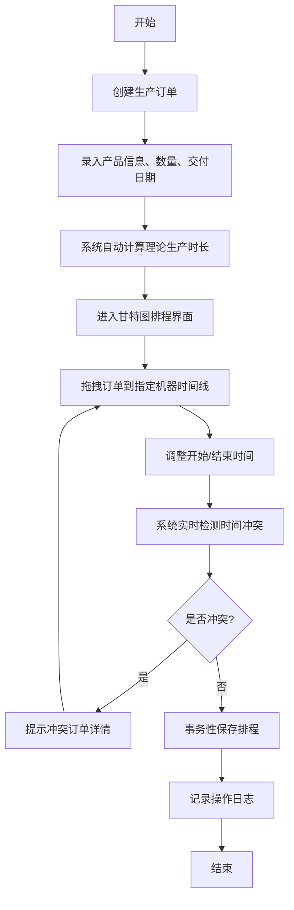
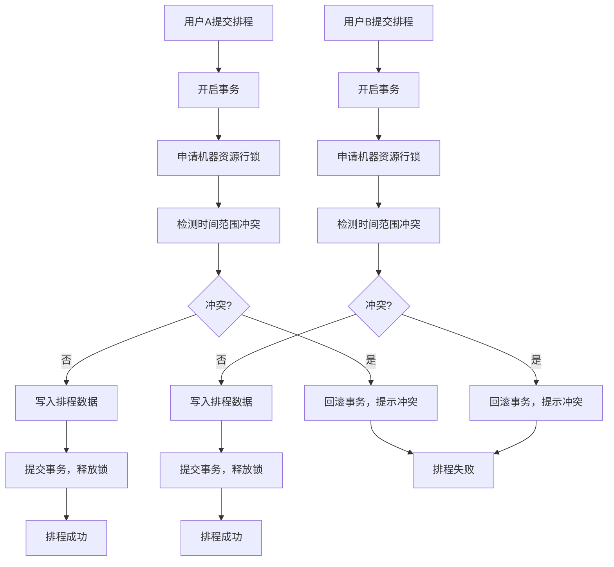

## 1. 产品概述

本系统为制造工厂开发的专业生产任务排程管理系统，通过甘特图可视化方式展示生产订单在各机器设备上的时间安排，支持多用户协同排程，具备实时时间重叠与资源冲突检测机制。

- 主要目的：解决制造工厂生产排程混乱、资源冲突、超排现象等问题，提高生产计划的合理性与可行性
- 目标用户：生产计划员、车间管理人员、生产调度人员
- 市场价值：提升生产效率30%以上，减少排程冲突，确保按时交付，降低生产成本

## 2. 核心功能

### 2.1 用户角色

| 角色 | 注册方式 | 核心权限 |
|------|----------|----------|
| 系统管理员 | 后台创建 | 用户管理、权限配置、系统设置、数据备份 |
| 计划员 | 管理员创建 | 订单管理、甘特图排程、冲突处理、数据查看 |
| 查看者 | 管理员创建 | 订单查询、甘特图查看、报表导出 |

### 2.2 功能模块

1. **订单管理模块**：订单列表、订单添加、订单编辑、订单删除、订单查询、工时自动计算
2. **甘特图排程模块**：机器时间轴展示、任务拖拽排程、时间调整、机器负载监控、多视图切换
3. **冲突检测模块**：实时冲突检测、并发控制、冲突提示、事务性保存
4. **系统管理模块**：用户管理、机器设备管理、产品工时配置、操作日志、数据备份

### 2.3 页面详情

| 页面名称 | 模块名称 | 功能描述 |
|---------|----------|----------|
| 登录页 | 身份认证 | 用户登录、密码验证、权限校验 |
| 首页仪表盘 | 数据概览 | 今日产能、订单统计、机器负载率、待排程订单数 |
| 订单管理页 | 订单管理 | 订单列表展示、搜索筛选、新增/编辑/删除订单、批量操作 |
| 甘特图排程页 | 甘特图排程 | 时间轴视图、任务拖拽排程、冲突检测、机器分组、缩放控制 |
| 机器管理页 | 系统管理 | 机器设备列表、新增/编辑/删除机器、机器状态管理 |
| 产品工时配置页 | 系统管理 | 产品列表、工时配置、生产工艺设置 |
| 用户管理页 | 系统管理 | 用户列表、角色分配、权限设置 |
| 操作日志页 | 系统管理 | 操作记录查询、筛选导出、审计追踪 |

## 3. 核心流程

### 3.1 订单创建与排程流程

计划员创建生产订单，系统自动计算生产时长，计划员在甘特图上拖拽任务进行排程，系统实时检测冲突，无冲突则保存排程，有冲突则提示详细信息。

### 3.2 并发排程控制流程

多用户同时操作时，系统通过数据库行锁和事务机制确保排程数据一致性，防止并发冲突。

## 4. 用户界面设计

### 4.1 设计风格

- **主色调**：工业蓝 (#1E40AF)，代表专业、可靠、高效
- **辅助色**：
  - 成功绿 (#059669)：表示正常、无冲突
  - 警告橙 (#D97706)：表示警告、高负载
  - 危险红 (#DC2626)：表示冲突、错误
  - 中性灰 (#64748B)：表示次要信息
- **按钮风格**：直角矩形，2px边框，hover时有微动画，active时有按压效果
- **字体**：
  - 标题：'Noto Sans SC', 700
  - 正文：'Noto Sans SC', 400
  - 数据：'JetBrains Mono', 400（等宽字体用于时间、数字展示）
- **布局风格**：
  - 左侧导航栏（固定宽度240px）
  - 顶部工具栏（高度56px）
  - 主内容区（自适应宽度，支持内部滚动）
  - 卡片式布局，层次分明，阴影适度
- **图标风格**：Lucide React 线性图标，统一尺寸20px，线条粗细1.5px

### 4.2 页面设计概览

| 页面名称 | 模块名称 | UI 元素 |
|---------|----------|---------|
| 登录页 | 身份认证 | 渐变背景、居中卡片、品牌Logo、表单输入、登录按钮、错误提示动画 |
| 首页仪表盘 | 数据概览 | 统计卡片（4个，带趋势箭头）、机器负载环形图、今日排程甘特缩略图、待办列表 |
| 订单管理页 | 订单管理 | 顶部筛选栏、数据表格（支持排序、分页）、操作列、新增/编辑弹窗、批量操作工具栏 |
| 甘特图排程页 | 甘特图排程 | 左侧机器列表、顶部时间轴标尺、主体甘特区域（可拖拽任务块）、缩放控制、冲突高亮、实时状态指示器 |
| 机器管理页 | 系统管理 | 卡片网格布局、机器状态指示灯、设备参数展示、新增/编辑表单 |
| 产品工时配置页 | 系统管理 | 表格布局、工时输入框、工艺步骤折叠面板 |
| 用户管理页 | 系统管理 | 用户列表、角色标签、权限矩阵表格、操作按钮组 |
| 操作日志页 | 系统管理 | 时间轴布局、操作类型标签、筛选条件、导出按钮 |

### 4.3 交互细节

- **甘特图拖拽**：任务块拖拽时显示半透明预览，冲突区域红色高亮，释放时弹性动画
- **冲突检测**：检测到冲突时，任务块边缘闪烁红光，弹出气泡提示冲突详情
- **数据加载**：使用骨架屏占位，加载完成后渐入动画
- **按钮交互**：hover时背景色加深+轻微上移，click时缩放0.98
- **表单验证**：实时验证，错误信息抖动动画，正确时显示绿色对勾

### 4.4 响应式设计

- **桌面端**（1280px+）：完整布局，左侧导航展开，所有功能可用
- **平板端**（768px-1279px）：左侧导航可折叠，甘特图自适应宽度
- **移动端**（<768px）：底部导航栏，甘特图支持手势缩放，核心功能可用
- **触控优化**：所有可点击元素最小尺寸44x44px，支持长按操作
