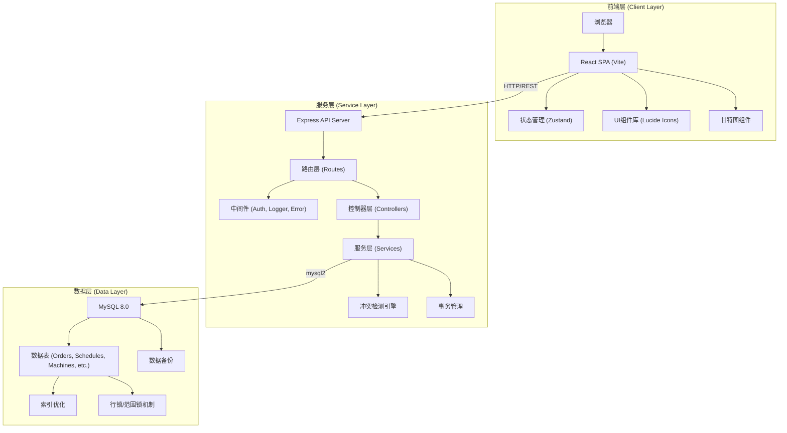
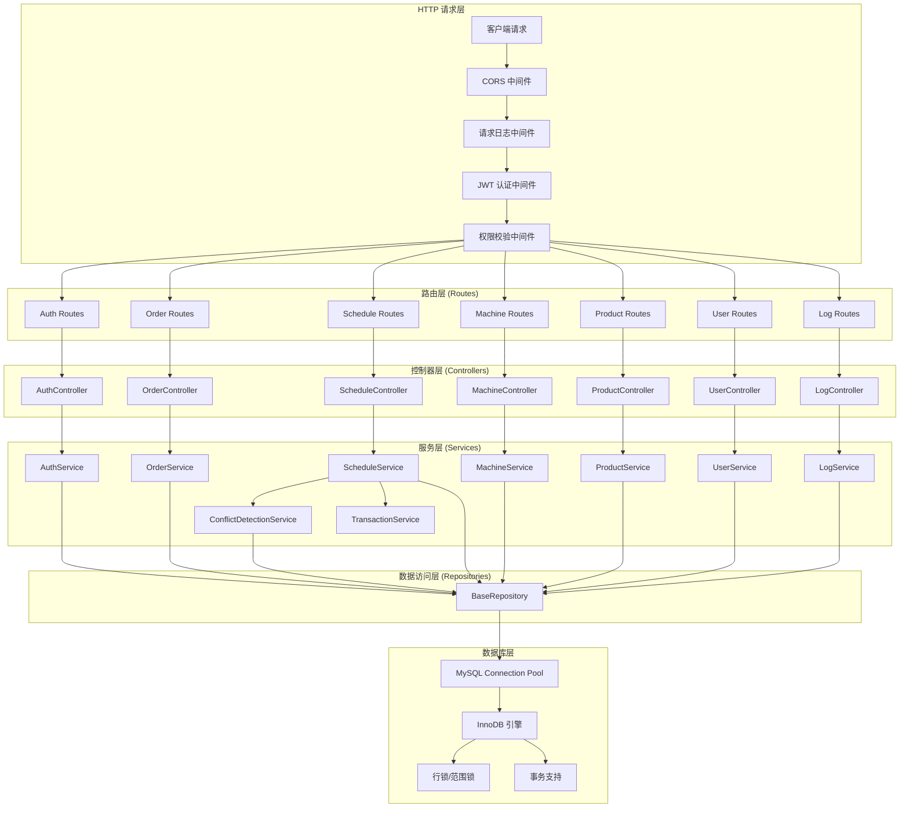
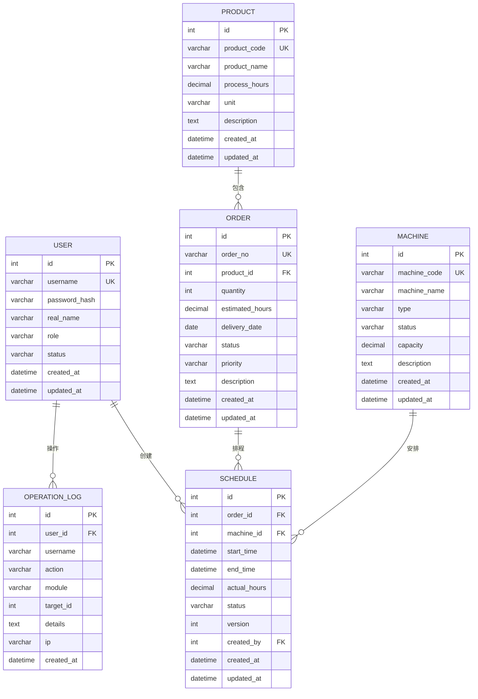

## 1. 架构设计

本系统采用前后端分离的三层架构，前端使用React构建交互式用户界面，后端使用Node.js + Express提供RESTful API服务，数据库采用MySQL存储生产数据。



## 2. 技术描述

- **前端**：React 18 + TypeScript + Vite 5 + Tailwind CSS 3 + Zustand 4
- **后端**：Node.js 20 + Express 4 + TypeScript + mysql2
- **数据库**：MySQL 8.0 (InnoDB 引擎，支持事务和行级锁)
- **认证**：JWT (jsonwebtoken) + bcrypt 密码加密
- **甘特图**：自研Canvas/SVG甘特图组件 + @dnd-kit/core 拖拽库
- **日志**：winston 日志框架 + 操作日志持久化
- **开发工具**：ESLint + Prettier + TypeScript

## 3. 路由定义

### 3.1 前端路由

| 路由 | 页面 | 权限 | 说明 |
|------|------|------|------|
| /login | 登录页 | 公开 | 用户身份认证 |
| /dashboard | 首页仪表盘 | 登录用户 | 数据概览和统计 |
| /orders | 订单管理页 | 计划员/管理员 | 订单CRUD操作 |
| /gantt | 甘特图排程页 | 计划员/管理员 | 可视化排程和冲突检测 |
| /machines | 机器管理页 | 管理员 | 机器设备管理 |
| /products | 产品工时配置页 | 管理员 | 产品和工时配置 |
| /users | 用户管理页 | 管理员 | 用户和权限管理 |
| /logs | 操作日志页 | 管理员 | 操作记录查询 |
| * | 404页面 | 公开 | 路由未找到 |

### 3.2 后端 API 路由

| 方法 | 路由 | 模块 | 说明 |
|------|------|------|------|
| POST | /api/auth/login | 认证 | 用户登录 |
| GET | /api/auth/profile | 认证 | 获取当前用户信息 |
| GET | /api/orders | 订单 | 获取订单列表 |
| GET | /api/orders/:id | 订单 | 获取订单详情 |
| POST | /api/orders | 订单 | 创建订单 |
| PUT | /api/orders/:id | 订单 | 更新订单 |
| DELETE | /api/orders/:id | 订单 | 删除订单 |
| GET | /api/schedules | 排程 | 获取排程列表 |
| POST | /api/schedules | 排程 | 创建排程（含冲突检测） |
| PUT | /api/schedules/:id | 排程 | 更新排程（含冲突检测） |
| DELETE | /api/schedules/:id | 排程 | 删除排程 |
| POST | /api/schedules/check-conflict | 排程 | 冲突预检测 |
| GET | /api/machines | 机器 | 获取机器列表 |
| POST | /api/machines | 机器 | 创建机器 |
| PUT | /api/machines/:id | 机器 | 更新机器 |
| DELETE | /api/machines/:id | 机器 | 删除机器 |
| GET | /api/products | 产品 | 获取产品列表 |
| POST | /api/products | 产品 | 创建产品 |
| PUT | /api/products/:id | 产品 | 更新产品 |
| DELETE | /api/products/:id | 产品 | 删除产品 |
| GET | /api/users | 用户 | 获取用户列表 |
| POST | /api/users | 用户 | 创建用户 |
| PUT | /api/users/:id | 用户 | 更新用户 |
| DELETE | /api/users/:id | 用户 | 删除用户 |
| GET | /api/logs | 日志 | 获取操作日志 |
| POST | /api/backup/create | 备份 | 创建数据备份 |
| GET | /api/backup/list | 备份 | 获取备份列表 |

## 4. API 定义

### 4.1 TypeScript 类型定义

```typescript
// 共享类型定义 (shared/types.ts)
export interface User {
  id: number;
  username: string;
  realName: string;
  role: 'admin' | 'planner' | 'viewer';
  status: 'active' | 'disabled';
  createdAt: string;
  updatedAt: string;
}

export interface Product {
  id: number;
  productCode: string;
  productName: string;
  processHours: number;
  unit: string;
  description: string;
  createdAt: string;
  updatedAt: string;
}

export interface Machine {
  id: number;
  machineCode: string;
  machineName: string;
  type: string;
  status: 'running' | 'idle' | 'maintenance' | 'broken';
  capacity: number;
  description: string;
  createdAt: string;
  updatedAt: string;
}

export interface Order {
  id: number;
  orderNo: string;
  productId: number;
  product?: Product;
  quantity: number;
  estimatedHours: number;
  deliveryDate: string;
  status: 'pending' | 'scheduled' | 'producing' | 'completed' | 'cancelled';
  priority: 'low' | 'medium' | 'high' | 'urgent';
  description: string;
  createdAt: string;
  updatedAt: string;
}

export interface Schedule {
  id: number;
  orderId: number;
  order?: Order;
  machineId: number;
  machine?: Machine;
  startTime: string;
  endTime: string;
  actualHours: number;
  status: 'scheduled' | 'in_progress' | 'completed';
  version: number;
  createdBy: number;
  createdAt: string;
  updatedAt: string;
}

export interface ConflictInfo {
  hasConflict: boolean;
  conflicts: Array<{
    scheduleId: number;
    orderNo: string;
    productName: string;
    startTime: string;
    endTime: string;
    overlapMinutes: number;
  }>;
}

export interface OperationLog {
  id: number;
  userId: number;
  username: string;
  action: string;
  module: string;
  targetId: number;
  details: string;
  ip: string;
  createdAt: string;
}

// API 请求/响应类型
export interface ApiResponse<T = any> {
  code: number;
  message: string;
  data: T;
  timestamp: number;
}

export interface LoginRequest {
  username: string;
  password: string;
}

export interface LoginResponse {
  token: string;
  user: User;
}

export interface CreateOrderRequest {
  orderNo: string;
  productId: number;
  quantity: number;
  deliveryDate: string;
  priority: string;
  description: string;
}

export interface CreateScheduleRequest {
  orderId: number;
  machineId: number;
  startTime: string;
  endTime: string;
}

export interface CheckConflictRequest {
  scheduleId?: number;
  machineId: number;
  startTime: string;
  endTime: string;
}
```

### 4.2 冲突检测 API 响应示例

```json
{
  "code": 200,
  "message": "success",
  "data": {
    "hasConflict": true,
    "conflicts": [
      {
        "scheduleId": 101,
        "orderNo": "ORD-2024-0015",
        "productName": "精密齿轮A-001",
        "startTime": "2024-06-10 08:00:00",
        "endTime": "2024-06-10 16:00:00",
        "overlapMinutes": 120
      }
    ]
  },
  "timestamp": 1718006400000
}
```

## 5. 服务器架构图



## 6. 数据模型

### 6.1 ER 图



### 6.2 DDL 语句

```sql
-- 数据库初始化脚本
CREATE DATABASE IF NOT EXISTS production_scheduling
CHARACTER SET utf8mb4
COLLATE utf8mb4_unicode_ci;

USE production_scheduling;

-- 用户表
CREATE TABLE IF NOT EXISTS users (
    id INT PRIMARY KEY AUTO_INCREMENT,
    username VARCHAR(50) NOT NULL UNIQUE,
    password_hash VARCHAR(255) NOT NULL,
    real_name VARCHAR(100) NOT NULL,
    role ENUM('admin', 'planner', 'viewer') NOT NULL DEFAULT 'viewer',
    status ENUM('active', 'disabled') NOT NULL DEFAULT 'active',
    created_at DATETIME NOT NULL DEFAULT CURRENT_TIMESTAMP,
    updated_at DATETIME NOT NULL DEFAULT CURRENT_TIMESTAMP ON UPDATE CURRENT_TIMESTAMP,
    INDEX idx_username (username),
    INDEX idx_role (role)
) ENGINE=InnoDB DEFAULT CHARSET=utf8mb4 COLLATE=utf8mb4_unicode_ci;

-- 产品表
CREATE TABLE IF NOT EXISTS products (
    id INT PRIMARY KEY AUTO_INCREMENT,
    product_code VARCHAR(50) NOT NULL UNIQUE,
    product_name VARCHAR(200) NOT NULL,
    process_hours DECIMAL(10,2) NOT NULL COMMENT '单位产品加工工时（小时）',
    unit VARCHAR(20) NOT NULL DEFAULT '件',
    description TEXT,
    created_at DATETIME NOT NULL DEFAULT CURRENT_TIMESTAMP,
    updated_at DATETIME NOT NULL DEFAULT CURRENT_TIMESTAMP ON UPDATE CURRENT_TIMESTAMP,
    INDEX idx_product_code (product_code),
    INDEX idx_product_name (product_name)
) ENGINE=InnoDB DEFAULT CHARSET=utf8mb4 COLLATE=utf8mb4_unicode_ci;

-- 机器表
CREATE TABLE IF NOT EXISTS machines (
    id INT PRIMARY KEY AUTO_INCREMENT,
    machine_code VARCHAR(50) NOT NULL UNIQUE,
    machine_name VARCHAR(200) NOT NULL,
    type VARCHAR(100) NOT NULL,
    status ENUM('running', 'idle', 'maintenance', 'broken') NOT NULL DEFAULT 'idle',
    capacity DECIMAL(10,2) NOT NULL DEFAULT 1.0 COMMENT '机器产能系数',
    description TEXT,
    created_at DATETIME NOT NULL DEFAULT CURRENT_TIMESTAMP,
    updated_at DATETIME NOT NULL DEFAULT CURRENT_TIMESTAMP ON UPDATE CURRENT_TIMESTAMP,
    INDEX idx_machine_code (machine_code),
    INDEX idx_status (status),
    INDEX idx_type (type)
) ENGINE=InnoDB DEFAULT CHARSET=utf8mb4 COLLATE=utf8mb4_unicode_ci;

-- 订单表
CREATE TABLE IF NOT EXISTS orders (
    id INT PRIMARY KEY AUTO_INCREMENT,
    order_no VARCHAR(50) NOT NULL UNIQUE,
    product_id INT NOT NULL,
    quantity INT NOT NULL,
    estimated_hours DECIMAL(10,2) NOT NULL COMMENT '预估生产工时 = 数量 * 产品工时 / 机器产能',
    delivery_date DATE NOT NULL,
    status ENUM('pending', 'scheduled', 'producing', 'completed', 'cancelled') NOT NULL DEFAULT 'pending',
    priority ENUM('low', 'medium', 'high', 'urgent') NOT NULL DEFAULT 'medium',
    description TEXT,
    created_at DATETIME NOT NULL DEFAULT CURRENT_TIMESTAMP,
    updated_at DATETIME NOT NULL DEFAULT CURRENT_TIMESTAMP ON UPDATE CURRENT_TIMESTAMP,
    FOREIGN KEY (product_id) REFERENCES products(id),
    INDEX idx_order_no (order_no),
    INDEX idx_status (status),
    INDEX idx_delivery_date (delivery_date),
    INDEX idx_product_id (product_id),
    INDEX idx_priority (priority)
) ENGINE=InnoDB DEFAULT CHARSET=utf8mb4 COLLATE=utf8mb4_unicode_ci;

-- 排程表（核心表）
CREATE TABLE IF NOT EXISTS schedules (
    id INT PRIMARY KEY AUTO_INCREMENT,
    order_id INT NOT NULL,
    machine_id INT NOT NULL,
    start_time DATETIME NOT NULL,
    end_time DATETIME NOT NULL,
    actual_hours DECIMAL(10,2) NOT NULL,
    status ENUM('scheduled', 'in_progress', 'completed') NOT NULL DEFAULT 'scheduled',
    version INT NOT NULL DEFAULT 0 COMMENT '乐观锁版本号',
    created_by INT NOT NULL,
    created_at DATETIME NOT NULL DEFAULT CURRENT_TIMESTAMP,
    updated_at DATETIME NOT NULL DEFAULT CURRENT_TIMESTAMP ON UPDATE CURRENT_TIMESTAMP,
    FOREIGN KEY (order_id) REFERENCES orders(id),
    FOREIGN KEY (machine_id) REFERENCES machines(id),
    FOREIGN KEY (created_by) REFERENCES users(id),
    INDEX idx_machine_time (machine_id, start_time, end_time),
    INDEX idx_order_id (order_id),
    INDEX idx_start_time (start_time),
    INDEX idx_end_time (end_time),
    INDEX idx_status (status),
    -- 用于冲突检测的复合索引
    INDEX idx_machine_status (machine_id, status)
) ENGINE=InnoDB DEFAULT CHARSET=utf8mb4 COLLATE=utf8mb4_unicode_ci;

-- 操作日志表
CREATE TABLE IF NOT EXISTS operation_logs (
    id INT PRIMARY KEY AUTO_INCREMENT,
    user_id INT NOT NULL,
    username VARCHAR(50) NOT NULL,
    action VARCHAR(100) NOT NULL,
    module VARCHAR(100) NOT NULL,
    target_id INT,
    details TEXT,
    ip VARCHAR(50),
    created_at DATETIME NOT NULL DEFAULT CURRENT_TIMESTAMP,
    FOREIGN KEY (user_id) REFERENCES users(id),
    INDEX idx_user_id (user_id),
    INDEX idx_module (module),
    INDEX idx_action (action),
    INDEX idx_created_at (created_at)
) ENGINE=InnoDB DEFAULT CHARSET=utf8mb4 COLLATE=utf8mb4_unicode_ci;

-- 初始数据：管理员账号 (密码: password)
INSERT INTO users (username, password_hash, real_name, role, status) VALUES
('admin', '$2b$10$N9qo8uLOickgx2ZMRZoMyeIjZAgcfl7p92ldGxad68LJZdL17lhWy', '系统管理员', 'admin', 'active'),
('planner1', '$2b$10$N9qo8uLOickgx2ZMRZoMyeIjZAgcfl7p92ldGxad68LJZdL17lhWy', '计划员A', 'planner', 'active'),
('planner2', '$2b$10$N9qo8uLOickgx2ZMRZoMyeIjZAgcfl7p92ldGxad68LJZdL17lhWy', '计划员B', 'planner', 'active'),
('viewer1', '$2b$10$N9qo8uLOickgx2ZMRZoMyeIjZAgcfl7p92ldGxad68LJZdL17lhWy', '查看员', 'viewer', 'active');

-- 初始数据：产品
INSERT INTO products (product_code, product_name, process_hours, unit, description) VALUES
('PRD-001', '精密齿轮A-001', 0.5, '件', '高精度传动齿轮，材料20CrMnTi'),
('PRD-002', '精密齿轮B-002', 0.8, '件', '重载传动齿轮，材料40CrNiMo'),
('PRD-003', '轴承座C-003', 1.2, '件', '大型轴承座，铸铁件'),
('PRD-004', '传动轴D-004', 0.6, '件', '精密传动轴，材料45钢'),
('PRD-005', '壳体E-005', 2.5, '件', '铝合金壳体，五轴加工');

-- 初始数据：机器设备
INSERT INTO machines (machine_code, machine_name, type, status, capacity, description) VALUES
('MCH-001', '数控车床CK6150', '数控车床', 'running', 1.0, '沈阳机床，最大切削直径500mm'),
('MCH-002', '数控车床CK6180', '数控车床', 'running', 1.2, '沈阳机床，最大切削直径800mm'),
('MCH-003', '加工中心VMC850', '立式加工中心', 'running', 1.0, '台湾友佳，三轴联动'),
('MCH-004', '加工中心VMC1060', '立式加工中心', 'idle', 1.3, '德国DMG，五轴联动'),
('MCH-005', '外圆磨床M1332', '磨床', 'running', 0.8, '上海机床，最大磨削直径320mm'),
('MCH-006', '滚齿机Y3180', '齿轮加工', 'maintenance', 1.0, '重庆机床，最大模数12mm');

-- 初始数据：测试订单
INSERT INTO orders (order_no, product_id, quantity, estimated_hours, delivery_date, status, priority, description) VALUES
('ORD-2024-0001', 1, 100, 50.00, '2024-06-20', 'pending', 'high', '客户A订单，急单'),
('ORD-2024-0002', 2, 50, 40.00, '2024-06-25', 'pending', 'medium', '客户B常规订单'),
('ORD-2024-0003', 3, 20, 24.00, '2024-06-18', 'pending', 'urgent', '客户C加急订单'),
('ORD-2024-0004', 4, 80, 48.00, '2024-06-30', 'pending', 'low', '客户D备货订单'),
('ORD-2024-0005', 5, 10, 25.00, '2024-07-05', 'pending', 'medium', '客户E新品订单');
```

### 6.3 冲突检测存储过程

```sql
-- 冲突检测存储过程（使用行锁机制）
DELIMITER //

CREATE PROCEDURE check_and_create_schedule(
    IN p_order_id INT,
    IN p_machine_id INT,
    IN p_start_time DATETIME,
    IN p_end_time DATETIME,
    IN p_actual_hours DECIMAL(10,2),
    IN p_created_by INT,
    OUT p_result_code INT,
    OUT p_result_message VARCHAR(500),
    OUT p_schedule_id INT
)
BEGIN
    DECLARE v_conflict_count INT DEFAULT 0;
    DECLARE v_conflict_details TEXT DEFAULT '';
    DECLARE v_order_no VARCHAR(50);
    DECLARE v_product_name VARCHAR(200);
    DECLARE v_old_start DATETIME;
    DECLARE v_old_end DATETIME;
    DECLARE v_overlap INT DEFAULT 0;
    DECLARE done INT DEFAULT FALSE;
    DECLARE cur CURSOR FOR
        SELECT s.id, o.order_no, p.product_name, s.start_time, s.end_time,
               TIMESTAMPDIFF(MINUTE,
                   GREATEST(s.start_time, p_start_time),
                   LEAST(s.end_time, p_end_time)
               ) as overlap_minutes
        FROM schedules s
        INNER JOIN orders o ON s.order_id = o.id
        INNER JOIN products p ON o.product_id = p.id
        WHERE s.machine_id = p_machine_id
          AND s.status IN ('scheduled', 'in_progress')
          AND s.start_time < p_end_time
          AND s.end_time > p_start_time
        FOR UPDATE; -- 行锁：锁定冲突检测范围内的记录
    DECLARE CONTINUE HANDLER FOR NOT FOUND SET done = TRUE;

    SET p_result_code = 0;
    SET p_result_message = '';
    SET p_schedule_id = 0;

    START TRANSACTION;

    -- 检查订单是否存在且状态允许排程
    SELECT order_no INTO v_order_no FROM orders WHERE id = p_order_id FOR UPDATE;
    IF v_order_no IS NULL THEN
        SET p_result_code = 404;
        SET p_result_message = '订单不存在';
        ROLLBACK;
        LEAVE check_and_create_schedule;
    END IF;

    -- 检查机器是否存在且可用
    SELECT machine_name INTO @machine_name FROM machines WHERE id = p_machine_id FOR UPDATE;
    IF @machine_name IS NULL THEN
        SET p_result_code = 404;
        SET p_result_message = '机器不存在';
        ROLLBACK;
        LEAVE check_and_create_schedule;
    END IF;

    -- 打开游标检测冲突（会锁定查询到的记录）
    OPEN cur;

    read_loop: LOOP
        FETCH cur INTO v_old_start, v_old_end, v_order_no, v_product_name, v_overlap;
        IF done THEN
            LEAVE read_loop;
        END IF;

        SET v_conflict_count = v_conflict_count + 1;
        SET v_conflict_details = CONCAT(v_conflict_details,
            IF(v_conflict_count > 1, '; ', ''),
            '订单:', v_order_no, ', 产品:', v_product_name,
            ', 时间:', DATE_FORMAT(v_old_start, '%Y-%m-%d %H:%i'),
            ' - ', DATE_FORMAT(v_old_end, '%Y-%m-%d %H:%i'),
            ', 重叠:', v_overlap, '分钟'
        );
    END LOOP;

    CLOSE cur;

    IF v_conflict_count > 0 THEN
        SET p_result_code = 409;
        SET p_result_message = CONCAT('检测到 ', v_conflict_count, ' 处时间冲突: ', v_conflict_details);
        ROLLBACK;
        LEAVE check_and_create_schedule;
    END IF;

    -- 无冲突，创建排程
    INSERT INTO schedules (order_id, machine_id, start_time, end_time, actual_hours, status, created_by)
    VALUES (p_order_id, p_machine_id, p_start_time, p_end_time, p_actual_hours, 'scheduled', p_created_by);

    SET p_schedule_id = LAST_INSERT_ID();

    -- 更新订单状态
    UPDATE orders SET status = 'scheduled', updated_at = NOW() WHERE id = p_order_id;

    COMMIT;

    SET p_result_code = 200;
    SET p_result_message = '排程创建成功';
END //

DELIMITER ;
```
