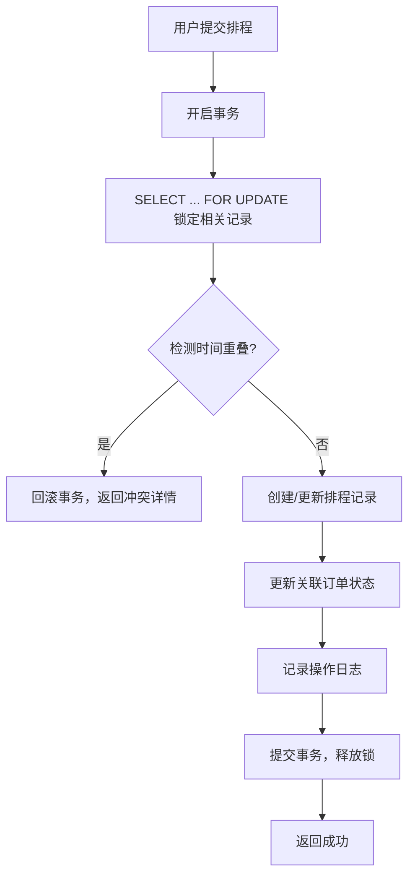

# 🏭 生产任务排程管理系统

> 专业的制造工厂生产任务排程管理平台，采用甘特图可视化方式展示各生产订单在不同机器设备上的时间安排，支持多用户协同排程，具备实时的时间重叠与资源冲突检测机制。

## ✨ 核心特性

### 📋 订单管理
- 生产订单的创建、编辑、查询和删除
- 录入产品信息、生产数量、交付日期等关键信息
- 根据预设的产品工时数据自动计算理论生产时长
- 支持按状态、优先级筛选和搜索

### 📊 甘特图可视化排程
- 交互式甘特图组件，支持将订单任务拖拽至指定机器的时间线
- 直观的时间轴展示，清晰显示各机器的负载情况和订单安排
- 支持拖拽方式修改订单的开始和结束时间
- 支持日/周视图切换，50%-200% 缩放控制
- 颜色编码区分优先级：🔴紧急 → 🟠高 → 🔵中 → 🟢低

### ⚠️ 冲突检测与并发控制
- **数据库级行锁机制**：使用 `SELECT ... FOR UPDATE` 锁定检测范围内的记录
- **实时冲突检测**：排程保存前执行严格的时间重叠检测
- **事务性操作**：所有排程操作在事务中执行，确保数据一致性
- **并发控制**：支持至少10名计划员同时在线操作
- **冲突详情提示**：明确显示重叠订单的订单号、产品名称、冲突时间段和重叠分钟数

### 👥 多用户权限管理
- **系统管理员**：完整权限，用户管理、系统配置、数据备份
- **计划员**：订单管理、甘特图排程、数据查看
- **查看者**：订单查询、甘特图查看、报表导出

### 📈 数据统计与监控
- 仪表盘概览：订单统计、机器负载率、今日排程数
- 机器状态监控：运行中/空闲/维护中/故障
- 操作日志审计：记录所有关键操作

## 🛠️ 技术栈

### 前端
- **React 18** + **TypeScript** - 类型安全的组件开发
- **Vite 5** - 极速开发和构建
- **Tailwind CSS 3** - 原子化 CSS 框架
- **Zustand 4** - 轻量级状态管理
- **@dnd-kit** - 强大的拖拽库
- **Recharts** - 数据可视化图表
- **Day.js** - 日期时间处理
- **Lucide React** - 精美图标库

### 后端
- **Node.js 20** + **Express 4** - 高性能 API 服务
- **TypeScript** - 类型安全的服务端开发
- **MySQL 8.0** + **mysql2** - 关系型数据库
- **JWT (jsonwebtoken)** - 身份认证
- **bcrypt** - 密码加密
- **Winston** - 日志框架

### 数据库特性
- **InnoDB 引擎** - 支持事务和行级锁
- **行锁/范围锁** - 并发控制核心机制
- **事务隔离级别** - READ-COMMITTED
- **复合索引优化** - 提升查询性能

## 📁 项目结构

```
production-scheduling/
├── .trae/documents/          # 项目文档
│   ├── prd.md                   # 产品需求文档
│   └── technical-architecture.md # 技术架构文档
├── api/                      # 后端代码
│   ├── config/                  # 配置
│   │   ├── database.ts              # 数据库连接池
│   │   └── logger.ts                # 日志配置
│   ├── controllers/             # 控制器层
│   │   ├── auth.controller.ts       # 认证控制器
│   │   ├── order.controller.ts      # 订单控制器
│   │   ├── schedule.controller.ts   # 排程控制器
│   │   ├── machine.controller.ts    # 机器控制器
│   │   ├── product.controller.ts    # 产品控制器
│   │   ├── user.controller.ts       # 用户控制器
│   │   ├── log.controller.ts        # 日志控制器
│   │   └── dashboard.controller.ts  # 仪表盘控制器
│   ├── middlewares/             # 中间件
│   │   ├── auth.middleware.ts       # 认证中间件
│   │   └── error.middleware.ts      # 错误处理中间件
│   ├── repositories/            # 数据访问层
│   │   ├── base.repository.ts       # 基础Repository
│   │   ├── order.repository.ts      # 订单Repository
│   │   ├── schedule.repository.ts   # 排程Repository (含行锁查询)
│   │   └── ...
│   ├── services/                # 业务逻辑层
│   │   ├── schedule.service.ts      # 排程服务 (核心冲突检测)
│   │   ├── order.service.ts         # 订单服务
│   │   ├── auth.service.ts          # 认证服务
│   │   └── ...
│   ├── routes/                  # 路由层
│   │   ├── schedules.routes.ts      # 排程路由
│   │   ├── orders.routes.ts         # 订单路由
│   │   └── ...
│   ├── utils/                   # 工具函数
│   │   └── response.ts              # 统一响应格式
│   ├── app.ts                   # Express 应用配置
│   └── server.ts                # 服务器启动
├── src/                      # 前端代码
│   ├── api/                     # API 客户端
│   │   ├── client.ts                # Axios 实例
│   │   ├── scheduleApi.ts           # 排程API
│   │   ├── orderApi.ts              # 订单API
│   │   └── ...
│   ├── components/              # 公共组件
│   │   ├── gantt/                   # 甘特图组件
│   │   │   ├── GanttCanvas.tsx          # 甘特图画布
│   │   │   ├── GanttTaskBlock.tsx       # 任务块组件
│   │   │   ├── GanttHeader.tsx         # 甘特图头部
│   │   │   ├── GanttSidebar.tsx        # 机器列表侧边栏
│   │   │   ├── DraggableTask.tsx       # 可拖拽任务
│   │   │   ├── UnscheduledOrdersPanel.tsx # 待排程订单面板
│   │   │   ├── TaskDetailPanel.tsx     # 任务详情面板
│   │   │   └── types.ts                # 甘特图类型定义
│   │   ├── Layout.tsx               # 布局组件
│   │   ├── Sidebar.tsx              # 侧边栏
│   │   ├── Header.tsx               # 顶部栏
│   │   └── ...
│   ├── pages/                   # 页面组件
│   │   ├── Login.tsx                # 登录页
│   │   ├── Dashboard.tsx            # 仪表盘
│   │   ├── OrdersPage.tsx           # 订单管理
│   │   ├── GanttPage.tsx            # 甘特图排程
│   │   ├── MachinesPage.tsx         # 机器管理
│   │   ├── ProductsPage.tsx         # 产品工时配置
│   │   ├── UsersPage.tsx            # 用户管理
│   │   ├── LogsPage.tsx             # 操作日志
│   │   └── NotFoundPage.tsx         # 404页面
│   ├── store/                   # 状态管理
│   │   ├── useAuthStore.ts          # 认证状态
│   │   └── useScheduleStore.ts      # 排程状态
│   ├── utils/                   # 工具函数
│   │   ├── datetime.ts              # 日期时间工具
│   │   └── gantt.ts                 # 甘特图计算工具
│   ├── App.tsx                   # 应用入口
│   ├── main.tsx                  # 渲染入口
│   └── index.css                 # 全局样式
├── shared/                   # 共享类型定义
│   └── types.ts                  # 前后端共享类型
├── migrations/               # 数据库迁移
│   └── 001_init_database.sql      # 数据库初始化脚本
├── scripts/                  # 脚本工具
│   ├── init-database.js          # 数据库初始化脚本
│   └── test-schedule-conflict.js # 冲突检测测试脚本
├── docs/                     # 项目文档
│   ├── 部署文档.md               # 系统部署指南
│   └── 用户操作手册.md           # 用户操作手册
├── .env                      # 环境变量配置
├── package.json              # 项目依赖
├── tsconfig.json             # TypeScript 配置
├── vite.config.ts            # Vite 配置
├── tailwind.config.js        # Tailwind 配置
└── README.md                 # 项目说明 (本文件)
```

## 🚀 快速开始

### 环境要求
- **Node.js** >= 20.0.0
- **MySQL** >= 8.0
- **npm** 或 **pnpm**

### 1. 克隆项目
```bash
git clone <repository-url>
cd production-scheduling
```

### 2. 安装依赖
```bash
npm install
```

### 3. 配置环境变量
编辑 `.env` 文件：
```env
PORT=3001
VITE_PORT=5173

DB_HOST=localhost
DB_PORT=3306
DB_USER=root
DB_PASSWORD=password
DB_NAME=production_scheduling

JWT_SECRET=production_scheduling_jwt_secret_key_2024
JWT_EXPIRES_IN=24h

NODE_ENV=development
```

### 4. 初始化数据库

**确保 MySQL 服务已启动，然后执行：**

```bash
# 方式1：使用Node.js脚本
node scripts/init-database.js

# 方式2：直接执行SQL
mysql -u root -p < migrations/001_init_database.sql
```

脚本会自动创建数据库、数据表，并插入初始测试数据。

### 5. 测试冲突检测机制（可选）
```bash
node scripts/test-schedule-conflict.js
```

这个测试会验证：
- ✅ 数据库行锁机制
- ✅ 事务隔离级别
- ✅ 时间重叠检测逻辑
- ✅ 并发操作下的数据一致性

### 6. 启动开发服务器

**同时启动前端和后端：**
```bash
npm run dev
```

**分别启动：**
```bash
# 启动后端 (端口 3001)
npm run server:dev

# 启动前端 (端口 5173)
npm run client:dev
```

### 7. 访问系统
- 前端地址：http://localhost:5173
- API 地址：http://localhost:3001/api

### 默认账号
| 角色 | 用户名 | 密码 |
|------|--------|------|
| 系统管理员 | admin | password |
| 计划员 | planner1 | password |
| 计划员 | planner2 | password |
| 查看者 | viewer1 | password |

> ⚠️ **安全提示**：首次登录后请立即修改默认密码！

## 🔧 核心功能详解

### 冲突检测机制

系统采用**数据库行锁 + 事务**的方案确保并发排程的数据一致性：



**时间重叠检测逻辑：**
```sql
WHERE s.machine_id = ?
  AND s.status IN ('scheduled', 'in_progress')
  AND s.start_time < ?  -- 已有排程开始时间 < 新排程结束时间
  AND s.end_time > ?    -- 已有排程结束时间 > 新排程开始时间
FOR UPDATE
```

**重叠时间计算：**
```javascript
overlapMinutes = TIMESTAMPDIFF(
  MINUTE,
  GREATEST(existing_start, new_start),
  LEAST(existing_end, new_end)
)
```

### 甘特图拖拽原理

使用 `@dnd-kit/core` 实现拖拽功能：
1. 拖拽开始时记录初始位置和时间
2. 拖拽过程中实时计算新的时间范围
3. 防抖调用后端 API 检测冲突
4. 冲突时任务块显示红色边框+闪烁动画
5. 释放时提交到后端进行最终的事务性验证

### 自动工时计算

```javascript
// 订单预估工时 = 生产数量 × 产品单位工时 ÷ 机器产能系数
estimatedHours = order.quantity * product.processHours / machine.capacity;
```

## 📋 API 接口速览

### 认证接口
| 方法 | 路径 | 说明 |
|------|------|------|
| POST | `/api/auth/login` | 用户登录 |
| GET | `/api/auth/me` | 获取当前用户信息 |

### 订单接口
| 方法 | 路径 | 说明 |
|------|------|------|
| GET | `/api/orders` | 获取订单列表 |
| GET | `/api/orders/:id` | 获取订单详情 |
| POST | `/api/orders` | 创建订单（自动计算工时） |
| PUT | `/api/orders/:id` | 更新订单 |
| DELETE | `/api/orders/:id` | 删除订单 |

### 排程接口（核心）
| 方法 | 路径 | 说明 |
|------|------|------|
| GET | `/api/schedules` | 获取排程列表 |
| GET | `/api/schedules/machine-load` | 获取机器负载 |
| POST | `/api/schedules/check-conflict` | 冲突预检测 |
| POST | `/api/schedules` | 创建排程（含冲突检测） |
| PUT | `/api/schedules/:id` | 更新排程（含冲突检测） |
| DELETE | `/api/schedules/:id` | 删除排程 |

### 其他接口
- `/api/machines` - 机器管理
- `/api/products` - 产品管理
- `/api/users` - 用户管理（管理员）
- `/api/logs` - 操作日志（管理员）
- `/api/dashboard` - 仪表盘统计

完整 API 文档请参考 `.trae/documents/technical-architecture.md`。

## 🧪 测试

### 类型检查
```bash
npm run check
```

### 代码 Lint
```bash
npm run lint
```

### 构建项目
```bash
npm run build
```

### 冲突检测单元测试
```bash
node scripts/test-schedule-conflict.js
```

## 📖 文档

- **产品需求文档**：[.trae/documents/prd.md](.trae/documents/prd.md)
- **技术架构文档**：[.trae/documents/technical-architecture.md](.trae/documents/technical-architecture.md)
- **部署文档**：[docs/部署文档.md](docs/部署文档.md)
- **用户操作手册**：[docs/用户操作手册.md](docs/用户操作手册.md)

## 🔒 安全特性

1. **JWT 身份认证**：无状态令牌认证，支持过期自动刷新
2. **密码加密**：使用 bcrypt 算法，盐值 10 轮
3. **权限控制**：基于角色的访问控制（RBAC）
4. **操作日志**：所有写操作记录详细日志，包含 IP 地址
5. **SQL 注入防护**：使用参数化查询
6. **CORS 配置**：严格的跨域访问控制
7. **乐观锁**：防止并发修改冲突

## 📊 性能指标

- **甘特图操作响应时间**：< 300ms
- **并发用户数**：支持至少 10 名计划员同时在线
- **API 响应时间**：平均 < 100ms（缓存命中）
- **数据库查询**：复合索引优化，单表查询 < 50ms

## 🤝 贡献指南

1. Fork 本仓库
2. 创建特性分支 (`git checkout -b feature/AmazingFeature`)
3. 提交更改 (`git commit -m 'Add some AmazingFeature'`)
4. 推送到分支 (`git push origin feature/AmazingFeature`)
5. 开启 Pull Request

## 📝 更新日志

### v1.0.0 (2024-06)
- ✅ 完成订单管理模块
- ✅ 完成甘特图可视化排程
- ✅ 完成数据库级冲突检测机制
- ✅ 完成多用户权限管理
- ✅ 完成操作日志审计
- ✅ 完成仪表盘数据统计

## 📄 许可证

本项目采用 MIT 许可证 - 详见 [LICENSE](LICENSE) 文件

## 👥 技术支持

如遇到问题或需要技术支持：
- 提交 Issue
- 查阅 [用户操作手册](docs/用户操作手册.md)
- 查阅 [常见问题排查](docs/部署文档.md#8-常见问题排查)

---

**祝您使用愉快！** 🎉

> 生产任务排程管理系统 - 让生产计划更智能、更高效
